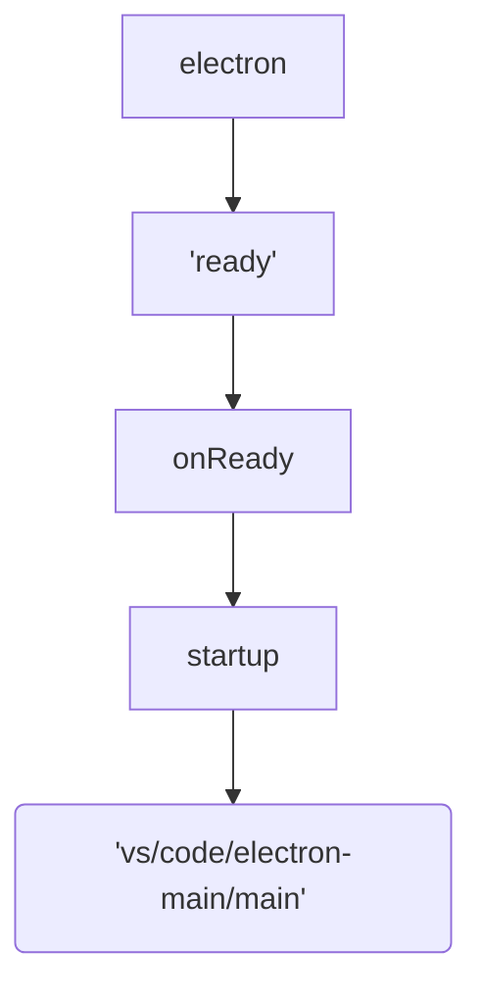

# VSCode 代码走读

## 前提

- 有nodejs开发经验
- 了解electron基本概念: `main process`、`share process`、`renderer process`

## Electorn main NODE 部分

 electron-main 提供了访问node API能力,即不能调用 web 任何对象，可以调用 nodejs 对象或 C++ 模块等（不能访问 rendererProcess）。

### package.json

electron 进程入口描述,详细查看 electron文档

```json
  "main": "./out/main",
```
指定为编译后程序入口文件，源码对应的文件为 `src/main.js`

### 启动入口文件 main.js

### vscode 启动入口运行过程



```javascript

// electron Ready事件
  app.once('ready', function () {
    if (args['trace']) {
      const contentTracing = require('electron').contentTracing;

      const traceOptions = {
        categoryFilter: args['trace-category-filter'] || '*',
        traceOptions: args['trace-options'] || 'record-until-full,enable-sampling'
      };

      contentTracing.startRecording(traceOptions).finally(() => onReady());
    } else {
      onReady();
    }
  });
  // 预加载nls 信息 调用 startup
  async function onReady() {
    perf.mark('code/mainAppReady');

    try {
      const [, nlsConfig] = await Promise.all([mkdirpIgnoreError(codeCachePath), resolveNlsConfiguration()]);

      startup(codeCachePath, nlsConfig);
    } catch (error) {
      console.error(error);
    }
  }

  function startup(codeCachePath, nlsConfig) {
      nlsConfig._languagePackSupport = true;

      process.env['VSCODE_NLS_CONFIG'] = JSON.stringify(nlsConfig);
      process.env['VSCODE_CODE_CACHE_PATH'] = codeCachePath || '';

      // Load main in AMD
      perf.mark('code/willLoadMainBundle');
      require('./bootstrap-amd').load('vs/code/electron-main/main', () => {                             <----
          perf.mark('code/didLoadMainBundle');
      });
  }
```

## Electron-main CodeMain
  VSCode 主进程入口


### main() 入口方法

### startup() 调用createServices，创建CodeApplication实例.startup()

  createServices: 创建公用服务，并注入ServiceCollection，类似于IOC容理管理类实例对象。

- instantionService:实例化服务
- environmentMainService：环境主进程服务 process.env
- bufferLogService： 缓冲日志服务
- fileService: 磁盘文件服务
- loggerService: 日志服务
- configurationService：配置服务
- LifecycleService: 生命周期服务
- stateMainService： 状态主服务
- Request : 请求服务
- Theme: 主题服务
- Signing: 登陆服务
- tunnel: 隧道服务
- Protocl : 协议服务
- instanceEnvironment：实例化运行环境
- productService：产品服务

```typescript
  private async startup(): Promise<void> {
    // Set the error handler early enough so that we are not getting the
    // default electron error dialog popping up
    setUnexpectedErrorHandler(err => console.error(err));

    // Create services
    // 创建共用服务
    const [instantiationService, instanceEnvironment, environmentMainService, configurationService, stateMainService, bufferLogService, productService] = this.createServices();

    try {

      // Init services
      try {
        await this.initServices(environmentMainService, configurationService, stateMainService);
      } catch (error) {

        // Show a dialog for errors that can be resolved by the user
        this.handleStartupDataDirError(environmentMainService, productService.nameLong, error);

        throw error;
      }

      // Startup
      // 调用方法，并注入依赖参数
      await instantiationService.invokeFunction(async accessor => {
        const logService = accessor.get(ILogService);
        const lifecycleMainService = accessor.get(ILifecycleMainService);
        const fileService = accessor.get(IFileService);

        // Create the main IPC server by trying to be the server
        // If this throws an error it means we are not the first
        // instance of VS Code running and so we would quit.
        // 声明主进程IPC服务
        const mainProcessNodeIpcServer = await this.claimInstance(logService, environmentMainService, lifecycleMainService, instantiationService, productService, true);

        // Write a lockfile to indicate an instance is running (https://github.com/microsoft/vscode/issues/127861#issuecomment-877417451)
        FSPromises.writeFile(environmentMainService.mainLockfile, String(process.pid)).catch(err => {
          logService.warn(`Error writing main lockfile: ${err.stack}`);
        });

        // Delay creation of spdlog for perf reasons (https://github.com/microsoft/vscode/issues/72906)
        bufferLogService.logger = new SpdLogLogger('main', join(environmentMainService.logsPath, 'main.log'), true, false, bufferLogService.getLevel());

        // Lifecycle
        once(lifecycleMainService.onWillShutdown)(evt => {
          fileService.dispose();
          configurationService.dispose();
          evt.join(FSPromises.unlink(environmentMainService.mainLockfile).catch(() => { /* ignored */ }));
        });
        // 创建实例CodeApplication
        return instantiationService.createInstance(CodeApplication, mainProcessNodeIpcServer, instanceEnvironment).startup();         <----
      });
    } catch (error) {
      instantiationService.invokeFunction(this.quit, error);
    }
  }
```
### <a href="vs-code:///Users/jaxchow/workspaces/vscode/src/vs/code/electron-main/app.ts">CodeApplication</a>
 VS code 单例应用对象
>The main VS Code application. There will only ever be one instance,
>even if the user starts many instances (e.g. from the command line).

#### CodeApplication.constructor

```typescript

constructor(
  private readonly mainProcessNodeIpcServer: NodeIPCServer,
  private readonly userEnv: IProcessEnvironment,
  @IInstantiationService private readonly mainInstantiationService: IInstantiationService,
  @ILogService private readonly logService: ILogService,
  @IEnvironmentMainService private readonly environmentMainService: IEnvironmentMainService,
  @ILifecycleMainService private readonly lifecycleMainService: ILifecycleMainService,
  @IConfigurationService private readonly configurationService: IConfigurationService,
  @IStateMainService private readonly stateMainService: IStateMainService,
  @IFileService private readonly fileService: IFileService,
  @IProductService private readonly productService: IProductService
) {
  super();

  this.configureSession(); //配置会话
  this.registerListeners(); //注册监听，监听进程错误 uncaughtException 、unhandledRejection 及 electron事件 activate、web-contents-created、open-file、new-window-for-tab等 绑定IPCMain 事件 vscode:fetchShellEnv、vscode:toggleDevTools、vscode:openDevTools 等应用事件
}

```

#### CodeApplication.starup()

创建主进程IPC服务
`const mainProcessElectronServer = new ElectronIPCServer();`

```typescript
async startup(): Promise<void> {
  this.logService.debug('Starting VS Code');
  this.logService.debug(`from: ${this.environmentMainService.appRoot}`);
  this.logService.debug('args:', this.environmentMainService.args);

  // Make sure we associate the program with the app user model id
  // This will help Windows to associate the running program with
  // any shortcut that is pinned to the taskbar and prevent showing
  // two icons in the taskbar for the same app.
  const win32AppUserModelId = this.productService.win32AppUserModelId;
  if (isWindows && win32AppUserModelId) {
    app.setAppUserModelId(win32AppUserModelId);
  }

  // Fix native tabs on macOS 10.13
  // macOS enables a compatibility patch for any bundle ID beginning with
  // "com.microsoft.", which breaks native tabs for VS Code when using this
  // identifier (from the official build).
  // Explicitly opt out of the patch here before creating any windows.
  // See: https://github.com/microsoft/vscode/issues/35361#issuecomment-399794085
  try {
    if (isMacintosh && this.configurationService.getValue('window.nativeTabs') === true && !systemPreferences.getUserDefault('NSUseImprovedLayoutPass', 'boolean')) {
      systemPreferences.setUserDefault('NSUseImprovedLayoutPass', 'boolean', true as any);
    }
  } catch (error) {
    this.logService.error(error);
  }

  // Main process server (electron IPC based)
  // 创建主进程Electron服务,提供ElectronIPC通信
  const mainProcessElectronServer = new ElectronIPCServer();

  // Resolve unique machine ID
  this.logService.trace('Resolving machine identifier...');
  const machineId = await this.resolveMachineId();
  this.logService.trace(`Resolved machine identifier: ${machineId}`);

  // Shared process

  const { sharedProcess, sharedProcessReady, sharedProcessClient } = this.setupSharedProcess(machineId);                    <---

  // Services
  // 应用实例服务,调用系统层Windows、Dialogs、launch、Diagnostics、Issuess、Encrypthion、 keyboardLayout、Native Host、Stroage、 Webview Manager等
  // 创建共享进程，即 创建每个独的的BaseWindow 窗体对象渲染每个vscode窗体
  const appInstantiationService = await this.initServices(machineId, sharedProcess, sharedProcessReady);

  // Create driver

  if (this.environmentMainService.driverHandle) {
    const server = await serveDriver(mainProcessElectronServer, this.environmentMainService.driverHandle, this.environmentMainService, appInstantiationService);

    this.logService.info('Driver started at:', this.environmentMainService.driverHandle);
    this._register(server);
  }

  // Setup Auth Handler
  this._register(appInstantiationService.createInstance(ProxyAuthHandler));

  // Init Channels
  appInstantiationService.invokeFunction(accessor => this.initChannels(accessor, mainProcessElectronServer, sharedProcessClient));

  // Open Windows
  const windows = appInstantiationService.invokeFunction(accessor => this.openFirstWindow(accessor, mainProcessElectronServer));

  // Post Open Windows Tasks
  appInstantiationService.invokeFunction(accessor => this.afterWindowOpen(accessor, sharedProcess));

  // Tracing: Stop tracing after windows are ready if enabled
  if (this.environmentMainService.args.trace) {
    appInstantiationService.invokeFunction(accessor => this.stopTracingEventually(accessor, windows));
  }
}
```


#### setupShareProcess 设置共享进程

```typescript
private setupSharedProcess(machineId: string): { sharedProcess: SharedProcess, sharedProcessReady: Promise<MessagePortClient>, sharedProcessClient: Promise<MessagePortClient> } {
  //注册共享进程到 主进程管理服务
  const sharedProcess = this._register(this.mainInstantiationService.createInstance(SharedProcess, machineId, this.userEnv));    <----

  const sharedProcessClient = (async () => {
    this.logService.trace('Main->SharedProcess#connect');
    //连接共享进程
    const port = await sharedProcess.connect();

    this.logService.trace('Main->SharedProcess#connect: connection established');
    //创建消息客户端，主进程连接共享进程
    return new MessagePortClient(port, 'main');
  })();
  //  回调 sharedProcessReady调用 shreProcess.whenReady
  const sharedProcessReady = (async () => {
    await sharedProcess.whenReady();

    return sharedProcessClient;
  })();

	return { sharedProcess, sharedProcessReady, sharedProcessClient };
}
```

## SharedProcess 共享进程

每个VS code 窗体都创建在各自共享进程内运行，每个window 都是个独立的 BaseWindow 对象. 可以直接理解为每个独立子进程


### SharedProcess.constructor

```typescript
constructor(
  private readonly machineId: string,
  private userEnv: IProcessEnvironment,
  @IEnvironmentMainService private readonly environmentMainService: IEnvironmentMainService,
  @ILifecycleMainService private readonly lifecycleMainService: ILifecycleMainService,
  @ILogService private readonly logService: ILogService,
  @IThemeMainService private readonly themeMainService: IThemeMainService,
  @IProtocolMainService private readonly protocolMainService: IProtocolMainService
) {
  super();
  // 注册监听器，绑定vscode:createSharedProcessMessageChannel 主进程消息通道
  this.registerListeners();
}
private registerListeners(): void {

  // Shared process connections from workbench windows
  ipcMain.on('vscode:createSharedProcessMessageChannel', (e, nonce: string) => this.onWindowConnection(e, nonce));        <----

  // Shared process worker relay
  //回复 共享线程子进程webwork 通道
  ipcMain.on('vscode:relaySharedProcessWorkerMessageChannel', (e, configuration: ISharedProcessWorkerConfiguration) => this.onWorkerConnection(e, configuration));

  // Lifecycle
  this._register(this.lifecycleMainService.onWillShutdown(() => this.onWillShutdown()));
}

```

### SharedProcess Event onWindowConnection
  待主进程发送消息`vscode:createShareProcessMessageChannel`

```typescript
private async onWindowConnection(e: IpcMainEvent, nonce: string): Promise<void> {
  this.logService.trace('SharedProcess: on vscode:createSharedProcessMessageChannel');

  // release barrier if this is the first window connection
  if (!this.firstWindowConnectionBarrier.isOpen()) {
    this.firstWindowConnectionBarrier.open();
  }

  // await the shared process to be overall ready
  // we do not just wait for IPC ready because the
  // workbench window will communicate directly
  // 共享进程发送消息告知主进程实始化完成
  await this.whenReady();

  // connect to the shared process window
  const port = await this.connect();  <---

  // Check back if the requesting window meanwhile closed
  // Since shared process is delayed on startup there is
  // a chance that the window close before the shared process
  // was ready for a connection.
  if (e.sender.isDestroyed()) {
    return port.close();
  }

  // send the port back to the requesting window
  e.sender.postMessage('vscode:createSharedProcessMessageChannelResult', nonce, [port]);
}
```

#### SharedProcess.connect

```typescript
async connect(): Promise<MessagePortMain> {

  // Wait for shared process being ready to accept connection
  await this.whenIpcReady;          <-----

  // Connect and return message port
  const window = assertIsDefined(this.window);
  return connectMessagePort(window);
}
```


#### SharedProcess.whenIpcReady

```typescript
private get whenIpcReady() {
  if (!this._whenIpcReady) {
    this._whenIpcReady = (async () => {

      // Always wait for first window asking for connection
      await this.firstWindowConnectionBarrier.wait();

      // Create window for shared process
      this.createWindow();                  <---- 创建 Electron BaseWindow对象

      // Listeners
      this.registerWindowListeners();

      // Wait for window indicating that IPC connections are accepted
      await new Promise<void>(resolve => ipcMain.once('vscode:shared-process->electron-main=ipc-ready', () => {
        this.logService.trace('SharedProcess: IPC ready');

        resolve();
      }));
    })();
  }

  return this._whenIpcReady;
}

```


####  SharedProcess.createWindow

 创建Electron BaseWindow对象，chromeium 运行时容器，提供web页面运行时环境
 平常日常可见的 Vscode 窗口体，在这时创建并设定 loadURL 与 preload 。

```typescript
private createWindow(): void {
  const configObjectUrl = this._register(this.protocolMainService.createIPCObjectUrl<ISharedProcessConfiguration>());

  // shared process is a hidden window by default
  // 创建Electron BaseWindow对象，chromeium 运行时容器，提供web页面运行时环境
  this.window = new BrowserWindow({
    show: false,
    backgroundColor: this.themeMainService.getBackgroundColor(),
    webPreferences: {
      preload: FileAccess.asFileUri('vs/base/parts/sandbox/electron-browser/preload.js', require).fsPath,
      additionalArguments: [`--vscode-window-config=${configObjectUrl.resource.toString()}`, '--vscode-window-kind=shared-process'],
      v8CacheOptions: this.environmentMainService.useCodeCache ? 'bypassHeatCheck' : 'none',
      nodeIntegration: true,
      nodeIntegrationInWorker: true,
      contextIsolation: false,
      enableWebSQL: false,
      spellcheck: false,
      nativeWindowOpen: true,
      images: false,
      webgl: false
    }
  });

  // Store into config object URL
  configObjectUrl.update({
    machineId: this.machineId,
    windowId: this.window.id,
    appRoot: this.environmentMainService.appRoot,
    codeCachePath: this.environmentMainService.codeCachePath,
    backupWorkspacesPath: this.environmentMainService.backupWorkspacesPath,
    userEnv: this.userEnv,
    args: this.environmentMainService.args,
    logLevel: this.logService.getLevel(),
    product
  });

  // Load with config
  this.window.loadURL(FileAccess.asBrowserUri('vs/code/electron-browser/sharedProcess/sharedProcess.html', require).toString(true));    <-----
}
```

---------------------------------------------------------
      Electron 分隔线，以下部分与上面不同层次
---------------------------------------------------------

## Electron Renderer 部分

> shared process: 可以调用 `main process` API代码或 electron shared Process
